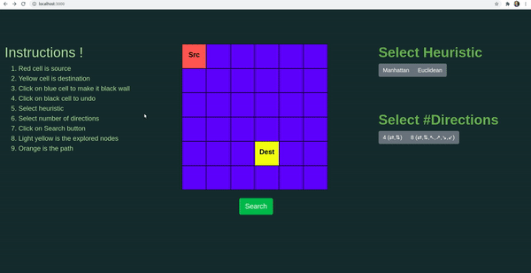

# [Live app link](https://search-path-in-matrix.netlify.app/)

Search path from source to destination in 2D matrix uing A* algorithm

Setup :
### `npm start`

Runs the app in the development mode. 
Open [http://localhost:3000](http://localhost:3000) to view it in the browser.

The page will reload if you make edits. 
You will also see any lint errors in the console.
